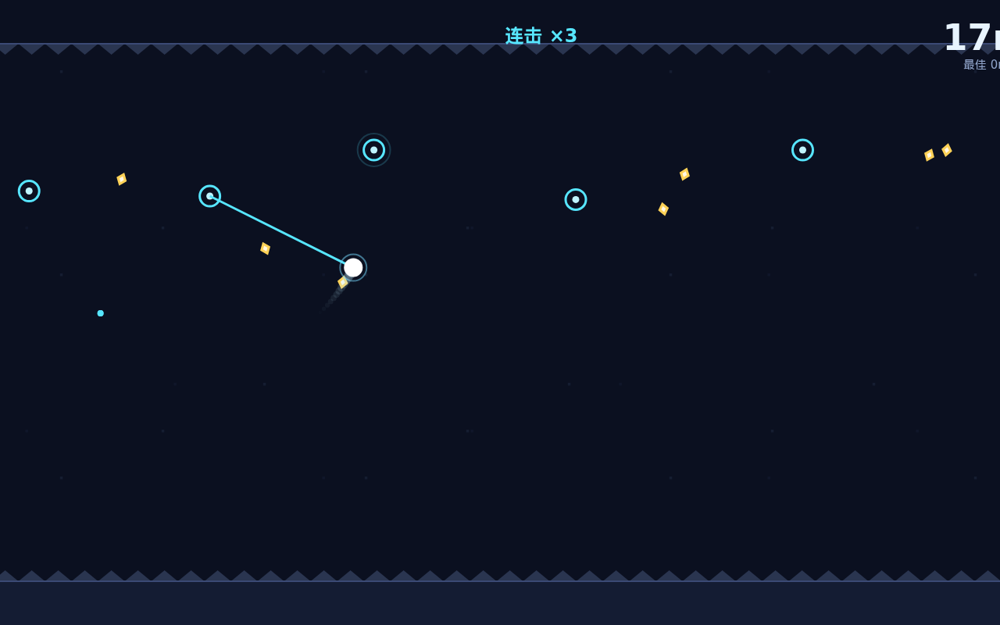

# 磁索 MAGNETO

[English](README.md) | **简体中文**

**单键磁索摆荡**：按住吸上磁锚荡起来，松手把自己甩向前方。索会烧断，地是尖刺，荡得越远分越高。

▶ **在线试玩**：https://xiangjianan.github.io/magneto-swing-20260911/ （双击 index.html 也能玩，零依赖）

## 玩法

- **按住（鼠标/触屏/空格）**：向最近、偏前方的磁锚发射磁索，吸附后绕锚点做圆周摆荡，索会持续向前"磁泵"加速
- **松手**：沿切线方向抛出——在右下象限上摆段松手，能把自己甩向右上远处
- **索会耗损**：吸附超过约 2.3 秒开始滴答预警，3.5 秒崩断；低锚点会自动收紧索长防扫地板
- **红色锚点是斥力锚**：不能吸，靠近会被弹开——有时是免费助推，有时把你拍进锯轮
- **金屑**：靠近自动磁吸收集，连收出 combo 加分
- **里程碑**：每 25m 弹一次提示；锯轮在 60m 后出现，难度随距离爬坡

死亡后一键立刻重开（按住任意键 0.9 秒防误触），最高纪录存在本地。

## 沉迷机制设计意图

| 钩子 | 实现 |
| --- | --- |
| 3 秒上手 | 只有一个键：按住=吸，松手=飞。出生锚点可复用，允许玩家安全地找节奏 |
| 短核心循环 | 一次"吸附→半圈→甩出"约 1 秒，单局 30 秒~2 分钟 |
| 即时反馈 | 吸附蓝爆粒子+上扬音、甩出嗖声、金屑叮声、combo 弹字、崩断噪音爆 |
| 失败即重开 | 死亡结算半屏 0.9 秒 → 任意键满血重开，全程 <1.5 秒 |
| 分数攀比 | 米数×金屑双维度最高纪录 localStorage 持久化，死亡结算屏大字对比 |
| 可见成长 | 里程碑弹幕、combo 计数、越远锚点越稀+锯轮登场，难度可感 |
| 保底式随机 | 世界随机生成但受米数约束：前 15m 无危险物，gap 随距离平滑加宽 |

玩法内核（单键定时释放的切线抛体 + 可复用锚点 + 索耗损）为原创组合，区别于 Stick Hero/旋转跳跳等同类单键游戏。

## 操作

| 平台 | 操作 |
| --- | --- |
| 手机 | 触屏按住 / 松开 |
| 桌面 | 鼠标左键按住 / 松开，或空格键 |

## 技术

- 单文件 `index.html`（~590 行），原生 Canvas + WebAudio 合成音效（无音频文件、无外部依赖、无构建）
- 自适应竖屏/横屏，devicePixelRatio 高清渲染
- 自测：`?autotest` 内置 AI 机器人自动游玩（吸附-甩出相位控制），120 秒零死亡抵达 20m+；`?shot=play|dead|menu` 输出宣传截图
